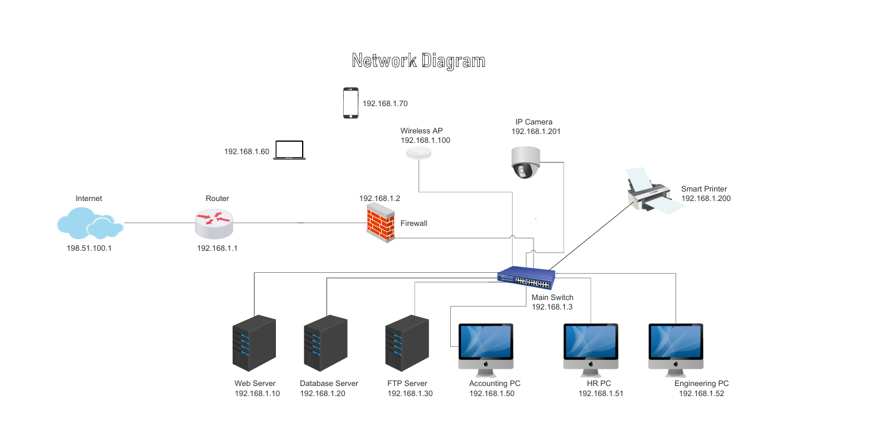
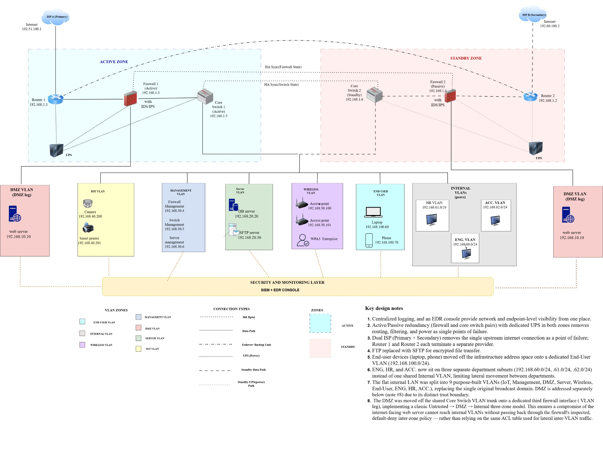

# Capstone 1: Network Security Redesign — Acme AeroTech

**Scenario:** Segmented network redesign for a fictional aerospace company.
**Design:** 9-VLAN topology, DMZ on a dedicated firewall leg, HA firewall pairs, IDS/IPS, SIEM/EDR. IP addressing per RFC 5737.
**Deliverables:** [Initial network diagram](initial-network-diagram.png) · [Redesigned network diagram](redesigned-network-diagram.jpeg) · [Vulnerability assessment](vulnerability-assessment.pdf)

## Initial Network

## Redesigned Network

